

# ACIM VHz Control

This application implements the V/Hz Open loop speed control of an AC Induction motor (ACIM). This application generates the three phase sinusoidal voltages based on the speed command using the V/Hz profile. The algorithm is implemented on a SAMC21J18A MCU.

## Description

AC Induction Motor (ACIM) is controlled using VHz control. Motor start/stop operation is controlled by the switch and motor speed can be changed by the on-board potentiometer. Waveforms and variables can be monitored runtime using X2CScope. 

Key features enabled in this project are:

- VHz Control

## MCC Project Configurations

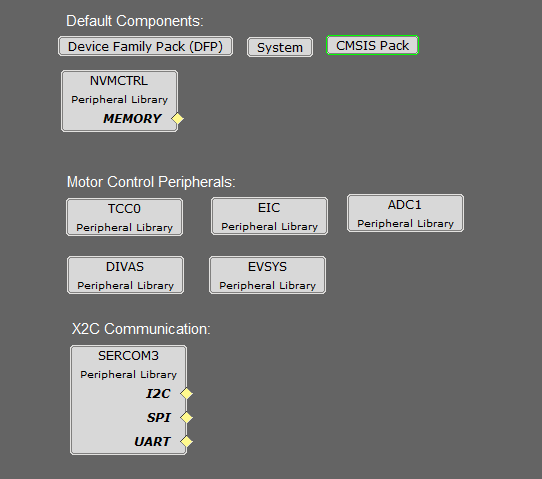

- **ADC1 Peripheral**: 

  - ADC1 operates to read the Potentiometer Speed Reference.
  - The ADC is hardware triggered by an event generated from the TCC0.
  - Enable Ready interrupt is generated by ADC1.

- **TCC0 Peripheral**: 

  - Configured to generate 3 pairs of complimentary PWM signals at a frequency of 20 kHz in "Dual Slope PWM with interrupt and event when the counter = ZERO".
  - Event output is enabled, which is generated when the counter reaches ZERO.
  - Dead-time is enabled and set to 1 µs.
  - Non-recoverable Fault is enabled on EV0. When an event is detected on EV0, all PWM channels are held low.

  
- **EIC**:
  - EIC Channel 2: External Interrupt Controller detects the hardware over current fault input and generates a non-recoverable fault event for the TCC0, thereby shutting down the PWM in the event of an over-current fault.
  - EIC Channel 11: External Interrupt Controller detects the Start and Stop push button command.

- **EVSYS**:
  - Event System acts as a moderator between the event generator and event users.
  - Event generated by the TCC0 when the counter reaches ZERO, is used by the ADC1 as a hardware trigger source via the Event System.
  Event generated by the EIC upon over-current fault, is used by the TCC0 as a non-recoverable fault event via the Event System.

- **DIVAS**:
  - This demo uses "Divide and Square Root Accelerator" to perform 32-bit signed and unsigned division and 32-bit unsigned square root operations.
  - DIVAS is set to overload "Divide - / " operator i.e. c = a / b; would use DIVAS accelerator for division without using a special API. However, square root operation would still require a special API. Refer to the DIVAS help for more details.
    
- **SERCOM3 Peripheral**: 

  - SERCOM3 is configured in USART mode and is set to operate at 115200 bps.
  - This USART channel is used by the X2CScope plugin to plot or watch global variables in run-time. Refer to X2C Scope Plugin section for more details on how to install and use the X2CScope.

## Control Algorithm

The project implements a V/Hz control algorithm on SAMC21 32-bit micro-controller to regulate the speed of the high voltage ACIM motor drive. The following section describes briefly the V/Hz control algorithm, software design, software configuration, and implementation details. The following block diagram shows a typical V/Hz control block diagram.

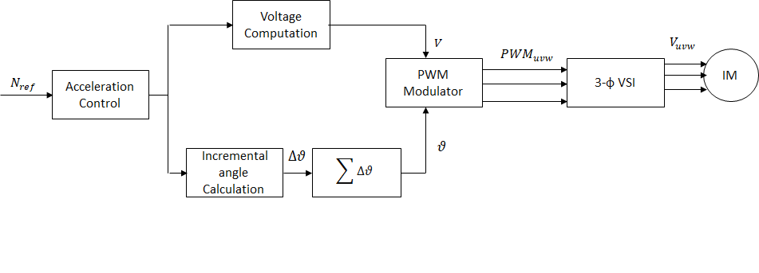

### V/Hz control algorithm:
The V/Hz control is a scalar control motor control strategy where the applied ratio of applied AC voltage and frequency is kept constant. The V/Hz control is carried out in the following steps-

1. Read the commanded speed request.
2. Determination of angular displacement per speed loop cycle.
3. Determination of AC voltage magnitude based on the angular displacement per speed loop cycle.
4. Determination of PWM modulation values for voltage source inverter.
5. Application of calculated PWM values to three phases of the ACIM motor.

#### Determination of angular displacement per speed loop cycle:
The requested ACIM motor speed is mapped to the angular displacement by using the following relation:

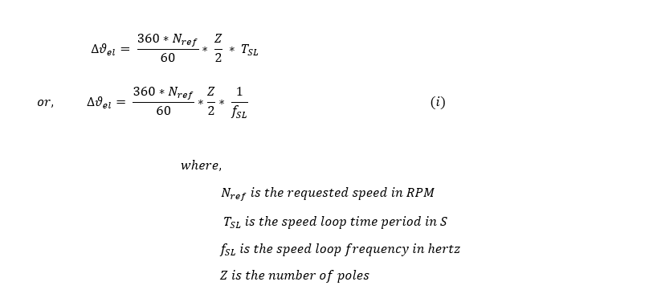

For fixed point implementation, the input speed is scaled from ( 0 , Nrated ) to ( 0 , 214 ) units.

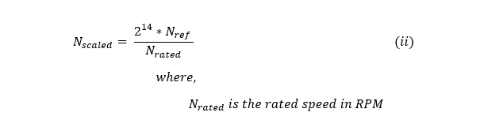

From (i) and (ii), we get,

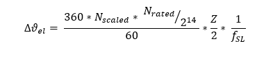

For fixed point implementation, the angle is scaled from ( 0 , 360 o ) to ( 0 , 216 ) units. Thus the final equation becomes:

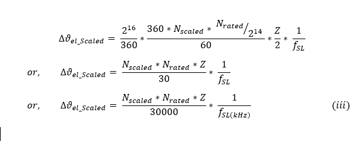

#### Determination of AC voltage magnitude for voltage source inverter:
The AC voltage magnitude is determined based on the requested RPM based on following relation:

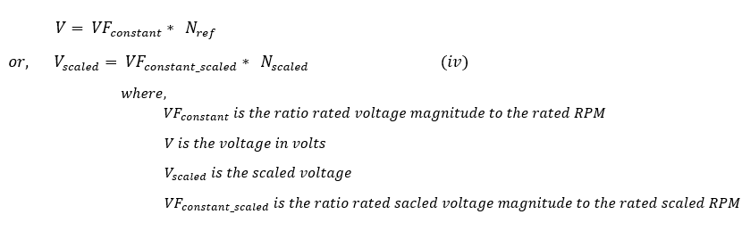

#### Determination of PWM modulation values for voltage source inverter:
The calculated voltage magnitude and phase is modulated using SVPWM approach to generate corresponding three phase gate control signals. This PWM modulation approach utilizes third order harmonic injection to increase the inverter DC bus utilization by about 15%. The following diagram shows the typical SVPWM waveform with third order harmonic injection:

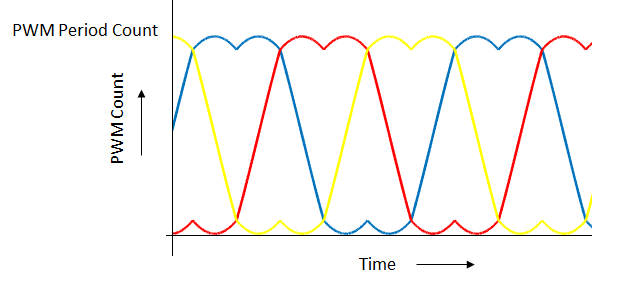

### Software Design
An interrupt based approach is used for the software implementation. There are three threads: main thread, ADC ISR thread, and a push button ISR thread.
The main thread is used to carry out UART based data communication in polling mode.
ADC ISR thread is used to carry out the actual V/Hz speed control algorithm. This thread is executed cyclically every PWM period as shown in the following figure: 

Push button ISR thread is used to carry out start and stop motor operations. This thread is non-cyclic and is executed once there is an external push button switch event.

The following figure shows the activity diagram of threads used in the software:

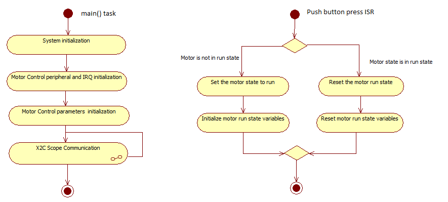

### Software Configuration:
The V/Hz control algorithm can be used to control different ACIM motors. In order to get the correct control of the ACIM motor, the motor specific parameters and application parameters need to be updated in the software. The following section describes how to update both motor and application specific parameters in the the project. These parameter macros can be found in userparams.h header file which can be found under logical path: Header Files > config > <config_name> >userparams.h.

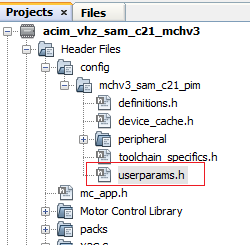

#### PWM frequency is set by configuring the timer period of the TCC0 in terms of TCC0 clock counts. The period value +1 set using the MHC needs to be redefined as a macro in userparams.h.
For example, in order to achieve a PWM frequency of 20 KHz, the period value defined in the MHC is 1199. Therefore, the macro defined in userparams.h should be "period value" + 1 = 1200.

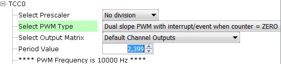

| Macro | Description |
|------|----------------|
| PWM_HPER_TICKS | PWM Timer period value = "Period value" defined in MHC + 1 |
| DEAD_TICKS | Dead-time defined in terms of PWM timer ticks = "Dead time value" defined in MHC |
|

#### Setting motor specific parameters:
Set the following motor specific parameters in the userparams.h file.

| Macro | Description | Unit |
|------|----------------|---------|
| MOTOR_VOLTAGE | Motor Voltage | Volts |
| MAX_MOTOR_SPEED | Maximum motor speed | RPM |
| NUMBER_OF_POLES | Number of Poles | - |
| MAX_SPEED_SCALED | Max speed | Internal units |
| VF_CONSTANT | Volts per RPM constant | Internal units |
| VF_OFFSET | Voltage offset at starting zero frequency | Internal units |
| START_SPEED_DEFAULT | Default startup speed | RPM |
| ACC_RAMP | acceleration ramp count in internal unit | Internal units |
| DEC_RAMP | deceleration ramp count in internal unit | Internal units |
| SPEED_FILTER_COEFF | Speed filter coefficient range [1-16] | - |
|

Note: The SAMC21 microcontroller devices do not have a floating point unit. Therefore, all the physical real variables are mapped to internal units for fixed point data processing in the software. The following table shows the mapping of physical quantities to their corresponding internal units.

| Physical Quantities | Physical Range | Conversion |
|------|----------------|---------|
| Speed | 0 to Nrated  | Physical Value * 214 / Nrated |
| Angle |0 to 360 deg | Physical Value * 216 / 360 |
| V/F constant | - | - |
| Speed Filter coefficient| 0-1 | Internal units |
|

## Development Kits

### MCHV3 with SAMC21 Family Motor Control PIM
#### Downloading and building the application

To clone or download this application from Github, go to the [main page of this repository](https://github.com/Microchip-MPLAB-Harmony/mc_apps_sam_c2x) and then click **Clone** button to clone this repository or download as zip file.
This content can also be downloaded using content manager by following these [instructions](https://github.com/Microchip-MPLAB-Harmony/contentmanager/wiki).

Path of the application within the repository is **apps/acim_vhz_sam_c21** .

To build the application, refer to the following table and open the project using its IDE.

| Project Name            | Description                                    | Demo User Guide |
| ----------------------- | ---------------------------------------------- |--------------------|
| mchv3_sam_c21_pim.X | MPLABX project for MCHV3 board with SAMC21 PIM |[MCHV3 with SAMC21 PIM](../docs/mchv3_samc21_pim_acim_vhz.md)|
||||

