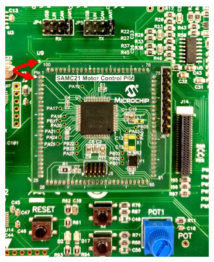
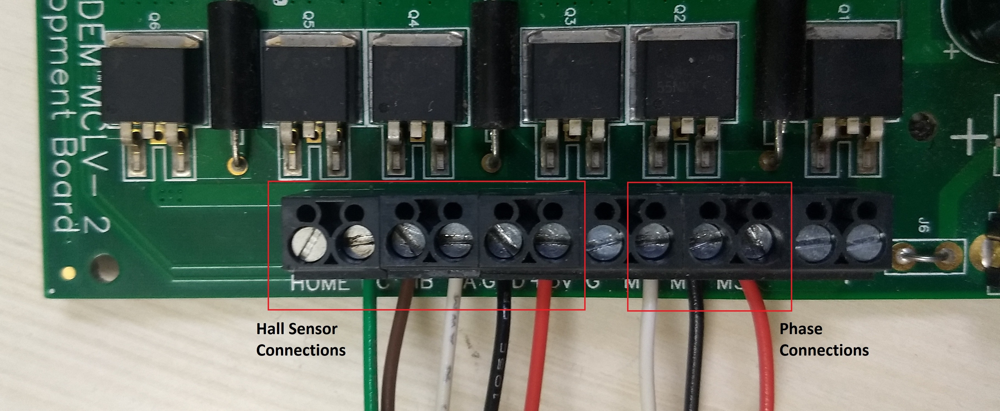

# MCLV2 Development Board
## Setting up the hardware

The following table shows the target hardware for the application projects.

| Project Name| Hardware |
|:---------:|:---------:|
| mclv2_sam_c21_pim.X | [MCLV2 Development Board](https://www.microchip.com/DevelopmentTools/ProductDetails/DM330021-2) [SAMC21 Motor Plugin Module](https://www.microchip.com/DevelopmentTools/ProductDetails/PartNO/MA320206) [Hurst Motor ](https://www.microchip.com/DevelopmentTools/ProductDetails/PartNo/AC300022) |
|||

### Setting up [MCLV2 Development Board](https://www.microchip.com/DevelopmentTools/ProductDetails/DM330021-2)

- Mount the SAMC21 Motor Control Plug In Module on U9 header. 

    

- Place the "External Opamp Configuration" Matrix board at J4.

    

- Motor and Hall Connections: 

  Motor phase connection for Long Hurst motor are given below:
    
  | Phase Connector |     Description   |
  |-----------------|-------------------|
  | White           |   M1  ( Phase U ) |
  | Black           |   M2  ( Phase V ) |
  | Red             |   M3  ( Phase W ) |

  Hall connection for long hurst motor are given below:
  
  | Hall Connector  | Description |
  |-----------------|-------------|
  | Red             |   +5V       |
  | Black           |    GND      |
  | White           |    HA       |
  | Brown           |    HB       |
  | Green           |    HC       |
  |                 |             |
  |
  
  

- Jumper Settings: 
    - JP1 - Curr, JP2 - Curr, JP3 - Curr 
    - In order to use RS232 port for X2CScope Communication JP4 - UART, JP5 - UART 
    - In order to use USB port for X2CScope Communication JP4 - USB, JP5 - USB

    

- Power the board with a 24V DC supply using J2 or BP1-BP2. For additional safety, it is recommended to use a current limited power supply while testing this software demonstration on a non-default hardware and motor. 

    

- Complete Setup

    

## Running the Application

1. Build and Program the application using its IDE
2. Press switch S2 to start the motor
3. Vary potentiometer to change the speed of the motor
4. Press switch S2 to stop the motor
5. Press switch S3 to change the direction of the motor
6. Press switch S2 again to start the motor
7. Monitor graphs on X2C Scope

Refer to the following tables for switch and LED details:

| Switch | Description |
|------|----------------|
| Switch S2 | To start or stop the motor |
| Switch S3 | To change the direction of rotation.  Direction toggle command is accepted only when motor is stationary. |
||

| LED D2 Status | Description |
|------|----------------|
| OFF  | Motor spin direction is "positive"  |
| ON  | Motor spin direction is "negative"   |
||

| LED D17 Status | Description |
|------|----------------|
| OFF  | No fault  |
| ON   | Fault is detected  |
||