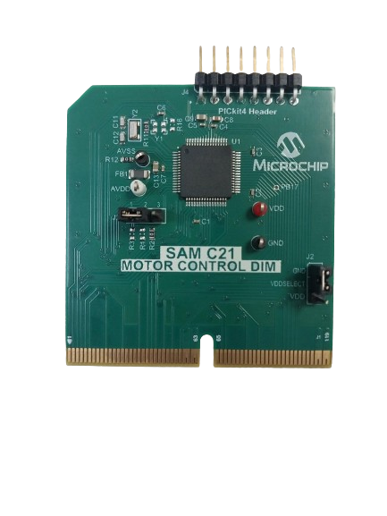
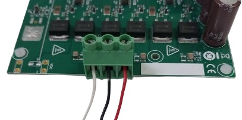
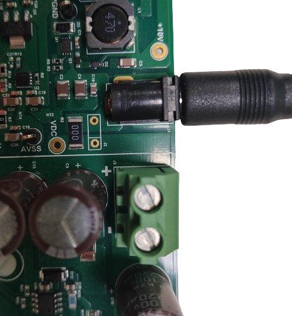

# MCLV 48V 300W Development Board

## Hardware Configuration

The table below lists the target hardware for the application projects.

    <table>
        <thead>
            <tr>
                <th>Project Name</th>
                <th>Hardware</th>
            </tr>
        </thead>
        <tbody>
            <tr>
                <td>qspin_pmsm_foc.X</td>
                <td>
                    <a href="https://www.microchip.com/en-us/development-tool/ev18h47a">MCLV 48V 300W Development Board</a>  
                    <a href="https://www.microchip.com/en-us/development-tool/EV74G56A">SAMC21 PIM</a>  
                    <a href="https://www.microchip.com/DevelopmentTools/ProductDetails/PartNo/AC300022">Hurst Motor with Encoder</a>
                </td>
            </tr>
        </tbody>
    </table>

### Setting Up the [MCLV 48V 300W Development Board](https://www.microchip.com/en-us/development-tool/ev18h47a)

1. **Install the SAMC21 Motor Control Dual In-Line Module into the J8 interface header.**  
    

        
    

2. **Connect the Motor:** Attach the 3-phase connections of the motor to the J4 header.  
    

        
    

3. **Power the Board:** Supply the board with 24V DC using the J1 or J3 (+, -) header.  
   For added safety, it is recommended to use a current-limited power supply while testing this software demonstration on non-default hardware and motors.  
    

        
    

## Running the Application

1. Build and program the application using its IDE.
2. Press switch SW2 to start the motor.
3. Vary the potentiometer to change the speed of the motor.
4. Press switch SW2 to stop the motor.
5. Press switch SW1 to change the direction of the motor.
6. Press switch SW2 again to start the motor.
7. Monitor graphs on X2C Scope.

Refer to the following tables for switch and LED details:

Refer to the following tables for switch and LED details:

    <table>
        <thead>
            <tr>
                <th>Switch</th>
                <th>Description</th>
            </tr>
        </thead>
        <tbody>
            <tr>
                <td>Switch SW2</td>
                <td>To start or stop the motor</td>
            </tr>
            <tr>
                <td>Switch SW1</td>
                <td>To change the direction of rotation.  Direction toggle command is accepted only when the motor is stationary.</td>
            </tr>
        </tbody>
    </table>

    <table>
        <thead>
            <tr>
                <th>LED D3 Status</th>
                <th>Description</th>
            </tr>
        </thead>
        <tbody>
            <tr>
                <td>OFF</td>
                <td>Motor spin direction is "positive"</td>
            </tr>
            <tr>
                <td>ON</td>
                <td>Motor spin direction is "negative"</td>
            </tr>
        </tbody>
    </table>

    <table>
        <thead>
            <tr>
                <th>LED D4 Status</th>
                <th>Description</th>
            </tr>
        </thead>
        <tbody>
            <tr>
                <td>OFF</td>
                <td>No fault</td>
            </tr>
            <tr>
                <td>ON</td>
                <td>Fault is detected</td>
            </tr>
        </tbody>
    </table>

