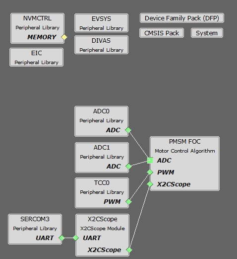

# PMSM FOC using PLL Estimator

This application implements the sensorless field oriented control (FOC) of a permanent magnet synchronous motor (PMSM). It estimates rotor position from measured phase currents and a PLL estimator. This algorithm is implemented on a SAMC21J18A MCU. It uses MCLV-48V-300W motor control development board.

## Description

Permanent Magnet Synchronous Motor (PMSM) is controlled using Field Oriented Control (FOC). Rotor position and speed is determined using a PLL estimator. Motor start/stop operation is controlled by the switch and motor speed can be changed by the on-board potentiometer. Waveforms and variables can be monitored runtime using X2CScope. 

Key features enabled in this project are:
- Dual shunt current measurement
- Speed control loop

## MCC Project Configurations

- **PMSM_FOC**:

    - This component configures FOC algorithm parameters, motor parameters and motor control board parameters. It connects to underlying peripheral libraries ADC and TCC. This component auto configures ADC channels and PWM channels as per PMSM_FOC component configurations.
    
- **ADC0-ADC1 Peripheral**: 

    - ADC0 and ADC1 are setup to operate in Master - Slave mode with ADC0 acting as a Master.
    - Both ADCs convert single ended inputs. Phase U current is sampled and converted by ADC0 and Phase V current is sampled and converted by ADC1.
    - Both ADCs are hardware triggered simultaneously by an event generated from TCC0 at the end of each PWM cycle.
    - Conversion Ready interrupt is generated by ADC0. Since both ADCs are triggered simultaneously and have same resolution and sampling time, both ADCs complete conversion at the same time.

- **TCC0 Peripheral**: 

  Configured to generate three pairs of complimentary PWM signals at a frequency of 10 kHz in "Dual Slope PWM with interrupt/event when counter = ZERO" a.k.a. "Center Aligned Mode".
  - Event output is enabled which is generated when the counter reaches ZERO.
  - Dead-time is enabled and set
  - Non-recoverable Fault is enabled on EV0. When an event is detected on EV0, all PWM channels are held low.

  
- **EIC**:
  - External Interrupt Controller detects a hardware over-current fault input and generates a non-recoverable fault event for TCC0, thereby shutting down the PWM in the event of an over-current fault.

- **EVSYS**:
  - Event System acts as an intermediary between event generator and event users.
  - Event generated by the TCC0 when the counter reaches ZERO, is used by the ADC0 as a hardware trigger source via the Event System.
  - Event generated by the EIC upon over-current fault, is used by the TCC0 as a non-recoverable fault event via the Event System.

- **DIVAS**:
  - This demo uses "Divide and Square Root Accelerator" to perform 32-bit signed and unsigned division and 32-bit unsigned square root operations.
  - DIVAS is set to overload "Divide - / " operator i.e. c = a / b; would use DIVAS accelerator for division without using a special API. However, square root operation would still require a special API. Refer to the DIVAS help for more details.
    
- **SERCOM3 Peripheral**: 
  - SERCOM3 is configured in USART mode and is set to operate at 115200 bps.
  - This USART channel is used by the X2CScope plugin to plot or watch global variables in run-time. Refer to X2C Scope Plugin section for more details on how to install and use the X2CScope.

## Control Algorithm
This project has been created using Harmony QSpin Tool. For details refer [Harmony QSpin](https://microchip-mplab-harmony.github.io/motor_control/index.html)

## Development Kits

### MCLV-48V-300W with SAMC21 Family Motor Control PIM
#### Downloading and building the application

To clone or download this application from Github, go to the [main page of this repository](https://github.com/Microchip-MPLAB-Harmony/mc_apps_sam_c2x) and then click **Clone** button to clone this repository or download as zip file.
This content can also be downloaded using content manager by following these [instructions](https://github.com/Microchip-MPLAB-Harmony/contentmanager/wiki).

Path of the application within the repository is **apps/pmsm_foc_pll_estimator_sam_c21** .

To build the application, refer to the following table and open the project using its IDE.

| Project Name            | Description                                    | Demo User Guide |
| ----------------------- | ---------------------------------------------- |--------------------|
| qspin_pmsm_foc.X | MPLABX project for MCLV-48V-300W board with SAMC21 PIM |[MCLV-48V-300W with SAMC21 DIM](../docs/mclv_samc21_dim_sensorless.md)|
||||
