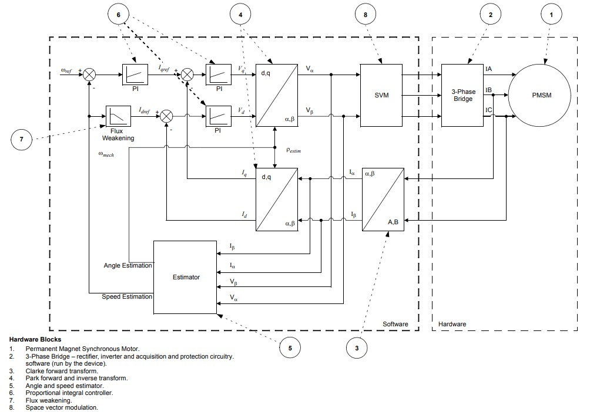
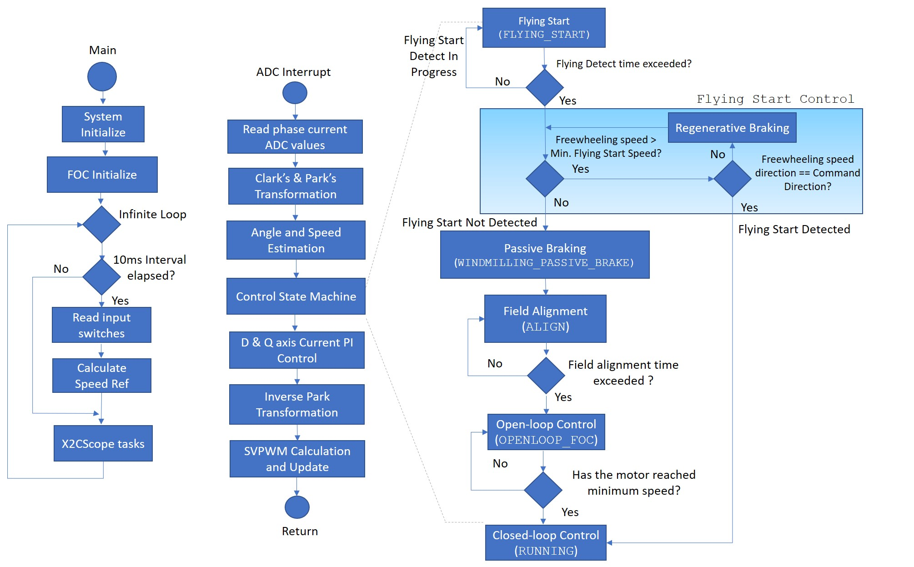
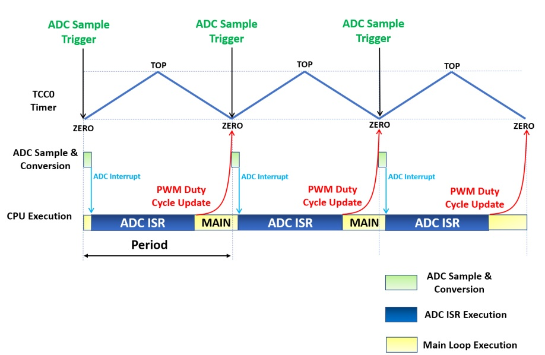
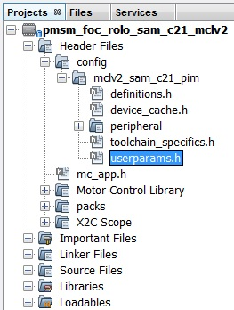

---
parent: Motor Control Application Examples for SAM C2x family
title: PMSM FOC using Reduced Order Leuenberger Observer (ROLO)
has_children: false
has_toc: false
---

# PMSM FOC using Reduced Order Luenberger Observer

This application implements the sensorless field oriented control (FOC) of a permanent magnet synchronous motor (PMSM). It estimates rotor position from measured phase currents and a reduced order luenberger observer (ROLO). This algorithm is implemented on a SAMC21J18A MCU.

## Description

Permanent Magnet Synchronous Motor (PMSM) is controlled using Field Oriented Control (FOC). Rotor position and speed is determined using Reduced Order Luenberger Observer. Motor start/stop operation is controlled by the switch and motor speed can be changed by the on-board potentiometer. Waveforms and variables can be monitored runtime using X2CScope. 

Key features enabled in this project are:

- Dual shunt current measurement
- Speed control loop
- Field weakening
- Flying Start

## MHC Project Configurations

- **ADC0-ADC1 Peripheral**: 

    - ADC0 and ADC1 are setup to operate in Master - Slave mode with ADC0 acting as a Master.
    - Both ADCs convert single ended inputs. Phase U current is sampled and converted by ADC0 and Phase V current is sampled and converted by ADC1.
    - Both ADCs are hardware triggered simultaneously by an event generated from TCC0 at the end of each PWM cycle.
    - Conversion Ready interrupt is generated by ADC0. Since both ADCs are triggered simultaneously and have same resolution and sampling time, both ADCs complete conversion at the same time.

- **TCC0 Peripheral**: 

  Configured to generate three pairs of complimentary PWM signals at a frequency of 10 kHz in "Dual Slope PWM with interrupt/event when counter = ZERO" a.k.a. "Center Aligned Mode".
  - Event output is enabled which is generated when the counter reaches ZERO.
  - Dead-time is enabled and set to
    - mchv3_sam_c21_pim.X. - 2uS
    - mclv2_sam_c21_pim.X. - 1uS
  - Non-recoverable Fault is enabled on EV0. When an event is detected on EV0, all PWM channels are held low.

  
- **EIC**:
  - External Interrupt Controller detects a hardware over-current fault input and generates a non-recoverable fault event for TCC0, thereby shutting down the PWM in the event of an over-current fault.

- **EVSYS**:
  - Event System acts as an intermediary between event generator and event users.
  - Event generated by the TCC0 when the counter reaches ZERO, is used by the ADC0 as a hardware trigger source via the Event System.
  - Event generated by the EIC upon over-current fault, is used by the TCC0 as a non-recoverable fault event via the Event System.

- **DIVAS**:
  - This demo uses "Divide and Square Root Accelerator" to perform 32-bit signed and unsigned division and 32-bit unsigned square root operations.
  - DIVAS is set to overload "Divide - / " operator i.e. c = a / b; would use DIVAS accelerator for division without using a special API. However, square root operation would still require a special API. Refer to the DIVAS help for more details.
    
- **SERCOM3 Peripheral**: 
  - SERCOM3 is configured in USART mode and is set to operate at 115200 bps.
  - This USART channel is used by the X2CScope plugin to plot or watch global variables in run-time. Refer to X2C Scope Plugin section for more details on how to install and use the X2CScope.

## Control Algorithm

This section briefly explains the FOC control algorithm, software design and implementation. Refer to [Application note AN2590](http://ww1.microchip.com/downloads/en/Appnotes/00002590B.pdf) for the ROLO based estimator based sensor-less FOC technique in detail. 

Field Oriented Control is the technique used to achieve the decoupled control of torque and flux. This is done by transforming the stator current quantities (phase currents) from stationary reference frame to torque and flux producing currents components in rotating reference frame using mathematical transformations. The Field Oriented Control is done as follows: 

1. Measure the motor phase currents. 
2. Transform them into the two phase system (a, b) using the Clarke transformation. 
3. Measure the rotor position angle. 
4. Transform stator currents into the d,q-coordinate system using the Park transformation. 
5. The stator current torque (iq) and flux (id) producing components are controlled separately by the controllers. 
6. The output stator voltage space vector is transformed back from the d,q-coordinate system into the two phase system fixed with the stator by the Inverse Park transformation. 
7. Using the space vector modulation, the three-phase output voltage is generated. 

The following block diagram shows the software realization of the FOC algorithm.

## Software Design

The following figure shows the flow chart of the implemented algorithm: 

### Field Alignment - ALIGN:
In this mode, a pre-defined value of the current is asserted across the Q axis of the rotor for a pre-defined length of time, in order to align the rotor to a known angle of 90 electrical degrees. The magnitude of the current and the length of the time for which it is applied depends upon the electrical and mechanical time constant of the PMSM motor drive. Electrical time constant of the motor is a function of R and L values of the motor windings, whereas the mechanical time constant of the motor drive is primarily a function of the static load on the motor shaft.

### Open Loop Control - STARTING:
In this mode, the speed of the PMSM motor is gradually ramped up using an open loop control. During this mode, the rotor angle is derived from the asserted open loop speed reference. This derived rotor angle would be lagging from the actual rotor angle. The speed is ramped up linearly to a minimum value required for the ROLO-based estimator to estimate the alpha and beta axis back EMF of the PMSM motor with sufficient accuracy. Rotor angle information is extracted from arctan(BEMFbeta/ BEMFalpha).

### Close Loop Control - RUNNING:
In this mode, the estimated rotor angle obtained from ROLO-based estimator is used to perform field oriented control of the PMSM motor.

### Timing Diagram:
The three critical blocks of the MCU which are involved in the motor control operations are:
- ADC - It measures motor phase currents at the start of the PWM cycle.
- CPU - Based on motor phase currents measurements, the CPU executes the control algorithm to calculate the PWM duty cycle needed to apply required voltage across motor windings.
- TCC0 - It generates the PWM signals needed to apply required voltage across motor windings.

The following timing diagram, shows the chronological role played by the ADC, CPU and TCC0 in the execution of FOC algorithm.

### Software Configuration
The FOC algorithm is used across different application fields. In order to get the optimal control of the PMSM motor, the motor specific parameters, board specific parameters and application parameter macros have to be updated in the software. The following section describes how to update both motor and application specific parameters in the the project. These parameter macros can be found in userparams.h header file which can be found under logical path: Header Files > config > <config_name> >userparams.h in MPLABX IDE.

#### Setting motor control PWM frequency and dead-time :

PWM frequency is set by configuring the timer period of the TCC0 in terms of TCC0 clock counts. This frequency needs to be communicated to other sections in the algorithm by defining the "Period Value" (set in MPLAB Harmony Configurator) + 1 as a macro in userparams.h.
For example, in order to achieve a PWM frequency of 10KHz in center aligned mode with peripheral clock frequency of 48MHz, the period value defined in MHC is 2399. Therefore, the macro defined in userparams.h should be "period value" + 1 = 2400.

| Macro | Description |
|------|----------------|
| PWM_HPER_TICKS | PWM Timer period value = "Period value" defined in MHC + 1                       |
| DEAD_TICKS     | Dead-time defined in terms of PWM timer ticks = "Dead time value" defined in MHC |
|                                                                                            

#### Setting motor specific parameters:

Set the following motor specific parameters in the userparams.h file.

| Macro | Description | Unit |
|----------------|---------------------------------------------|--------|
| RATED_FRE_HZ   | Electrical Frequency at rated motor speed   | Hz     |
| MAX_FRE_HZ     | Electrical Frequency at maximum motor speed | Hz     |
| MIN_FRE_HZ     | Electrical Frequency at minimum motor speed | Hz     |
| POLAR_COUPLES  | Number of Pole Pairs                        | -      |
| R_STA          | Motor per phase resistance                  | Ohm    |
| L_SYN          | Motor per phase inductance                  | Henry  |
| BEMF_CONST     | Back emf constant                           |Vp/ krpm|
| MAX_CUR_AMP    | Maximum motor current                       | Ampere |
| START_CUR_AMP  | Current reference during field alignment and open loop startup | Ampere |
| ACC_RPM_S      | Acceleration ramp rate                      | RPM/s  |
| DEC_RPM_S      | Deceleration ramp rate                      | RPM/s  |
| STUP_ACCTIME_S | Open loop start up time                     | s      |
| CUR_RISE_T     | Current rise time during field alignment    | s      |
| MIN_FS_FRE_HZ  | Minimum Flying Start Frequency              | Hz     |
| FLYING_START_CUR_AMP | Post FLying Start Detect startup current    | A     |
| RGN_BRK_CUR_AMP  | Regenerative Braking current    | A      |
| FLYING_START_TIME_SEC      |  Flying Start Detect Time in Seconds    | s      |
| PASSIVE_BRAKING_TIME_SEC  | Motor Braking Time     | s      |
| TORQUE_MODE_MIN_CUR_AMP   | Minimum Torque Mode Reference    | A    |
|       

#### Setting board specific parameters:
Set the following board specific parameters in the userparams.h file.

| Macro | Description | Unit |
|------|----------------|---------|
| CUR_SGN_REV | Define this macro, if the terminal of the shunt        resistor connected to the return path of the inverter is connected to the inverting terminal of the signal conditioning differential operational amplifier. Do Not define this macro, if the terminal of the shunt resistor connected to the return path of the inverter is connected to the non-inverting terminal of the signal conditioning differential operational amplifier | - |
| AD_RBA | Current measurement resolution of the board. This value is a function of shunt resistor, gain and bias of the differential opamp, reference voltage and the resolution of the ADC. For example, a board with a shunt resistance of 25 mOhm, differential opamp with a gain of 15 and bias of 1.65V, 12-bit ADC with reference voltage 3.3V, is capable of measuring +/- 4.4A i.e. a total of 8.8 A before ADC saturates. For such a board, AD_RBA = 4095/8.8 = 465.34 bits/A | bits/A |
| AD_RBV |Bus voltage measurement resolution of the board. This value is a function of DC bus voltage divider ratio, reference voltage and resolution of the ADC. For example, a board with a DC bus voltage divider ratio of 1:16, 12-bit ADC with reference voltage 3.3V, is capable of measuring up to 52.8 V before ADC saturates. For such a board, AD_RBV = 4095/52.8 = 77.55 bits/V |  bits/V | 
|

#### Setting PI Controller parameters:
Depending on the type of motor used, and the corresponding application PI controller parameters should be updated in the userparams.h file.

Speed PI controller gains: 

| Macro | Description |
|------|----------------|
| KP_AS_R | Proportional gain of speed controller |
| KI_A_R | Integral gain of speed controller |
|

Current PI controller gains for D and Q axis currents: 

| Macro | Description |
|------|----------------|
| KP_V_A | Proportional gain for D and Q axis current controller |
| KI_V_AS | Integral gain for D and Q axis current controller |
|

#### Debug & Optimization Modes :
This example provides compile time re-configuration options using #define macro directives to enable or disable different debug and optimization modes. These macro directives can be accessed in the userparams.h header file. 

  - Current PI Tuning - CURPI_TUN
    - This mode allows tuning of the Current PI controllers. This mode generates a step current reference and depending upon the actual current response, user can accordingly adjust current PI gains.
    - This mode can be enabled by defining the macro CURPI_TUN in userparams.h header file
    - In this mode, the step current reference is asserted across the D axis
    - Macro CUR_STEP_AMP defines the step size of the asserted D axis current reference in amperes and macro CUR_STEP_TIM defines the length of the step in seconds

  - Open Loop Mode - OPEN_LOOP_FUNCTIONING
    - This mode is used to debug the open loop startup of the motor. This mode could also be used in tuning of Current PI controllers
    - In this mode, the motor operates in open loop rotor angle mode. In other words, the rotor angle used by the algorithm to assert current will be different than actual rotor angle and therefore, the asserted current may not be orthogonal to the rotor magnetic axis, resulting in lower torque generation.
    - This mode can be enabled by defining the macro OPEN_LOOP_FUNCTIONING in userparams.h header file
    - The torque current reference in this mode is defined by the macro START_CUR_AMP
    - Depending upon the load inertia and startup acceleration time (STUP_ACCTIME_S), if the generated torque is not sufficient, then it may result in stalling of the motor
    - START_CUR_AMP and STUP_ACCTIME_S need to be modified to ensure that the motor starts up successfully in open loop mode without stalling. If the motor stalls and the PWM signals are shutdown, the algorithm enters into a critical fault mode. The MCU needs to be reset to recover from the critical fault.

  - Torque Mode - TORQUE_MODE
    - In this mode, as the name suggests, the algorithm operates in torque mode. The torque reference is obtained from the potentiometer.
    - This mode can be enabled by defining the macro TORQUE_MODE in userparams.h header file
    - The potentiometer min - max input is scaled to generate torque current reference in the range of TORQUE_MODE_MIN_CUR_AMP - MAX_CUR_AMP
    - Depending upon the load, if the torque is too low then it could cause the motor to stall and algorithm to enter a critical fault mode. The MCU needs to be reset to recover from the critical fault.

  - Field Weakening - FIELD_WEAKENING
    - Defining this macro enables Field Weakening allowing the PMSM motor to spin at speed greater than rated motor speed.
    - Note: RAM_EXECUTE macro must be enabled for proper functioning of Field Weakening

  - Flying Start Enable/Disable - FLYING_START_ENABLE
    - Undefining this macro, disables "Flying Start" capability of the algorithm
    - Note: You may see build errors if macro "RAM_EXECUTE" and "FLYING_START_ENABLE" are defined simultaneously.

  
  - Control Frequency to PWM Frequency = 1:1 - CTRL_PWM_1_1
    - Defining this macro, executes current and speed controllers every other PWM cycle.
    - Note: Please account for CPU bandwidth availability while setting Control to PWM Frequency Ratio as 1:1. If the ISR execution is not completed within the same PWM cycle, it could lead to erratic motor behavior

  - Executing from RAM - RAM_EXECUTE
    - In order to speed up execution, the frequently called motor control related functions can be placed and fetched from RAM during execution.
    - Fetching instructions from RAM is faster than fetching instructions from Flash, as fetches from RAM can occur at CPU clock speed, unlike the Flash, which requires wait states to be asserted.
    - This speed optimization feature can be enabled by defining the macro RAM_EXECUTE in userparams.h header file.
    - Enabling this mode would result in a larger data memory footprint.
    - Instruction breakpoint will not be asserted on an instruction which is being executed from RAM. It is recommended to disable this macro while debugging this algorithm using instruction breakpoints.
    - Exercise caution while using this feature as the functions in RAM are vulnerable to get overwritten due to stack overruns or unguarded buffer overruns.

## Development Kits

### MCLV2 with SAMC21 Family Motor Control PIM
#### Downloading and building the application

To clone or download this application from Github, go to the [main page of this repository](https://github.com/Microchip-MPLAB-Harmony/mc_apps_sam_c2x) and then click **Clone** button to clone this repository or download as zip file.
This content can also be downloaded using content manager by following these [instructions](https://github.com/Microchip-MPLAB-Harmony/contentmanager/wiki).

Path of the application within the repository is **apps/pmsm_foc_rolo_sam_c21** .

To build the application, refer to the following table and open the project using its IDE.

| Project Name            | Description                                    | Demo User Guide |
| ----------------------- | ---------------------------------------------- |--------------------|
| mclv2_sam_c21_pim.X | MPLABX project for MCLV2 board with SAMC21 PIM |[MCLV2 with SAMC21 PIM](../docs/mclv2_samc21_pim_sensorless.md)|
||||

### MCHV3 with SAMC21 Family Motor Control PIM
#### Downloading and building the application

To clone or download this application from Github, go to the [main page of this repository](https://github.com/Microchip-MPLAB-Harmony/mc_apps_sam_c2x) and then click **Clone** button to clone this repository or download as zip file.
This content can also be downloaded using content manager by following these [instructions](https://github.com/Microchip-MPLAB-Harmony/contentmanager/wiki).

Path of the application within the repository is **apps/pmsm_foc_rolo_sam_c21** .

To build the application, refer to the following table and open the project using its IDE.

| Project Name            | Description                                    | Demo User Guide |
| ----------------------- | ---------------------------------------------- |--------------------|
| mchv3_sam_c21_pim.X | MPLABX project for MCHV3 board with SAMC21 PIM |[MCHV3 with SAMC21 PIM](../docs/mchv3_samc21_pim_sensorless.md)|
||||

