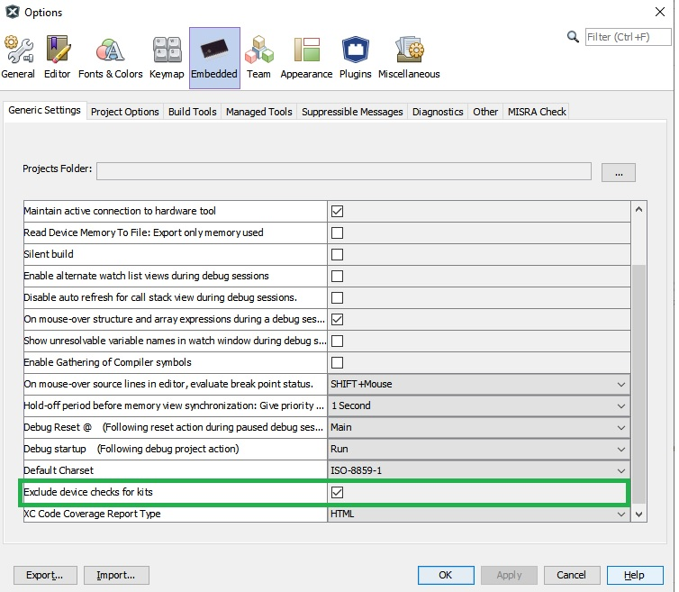

---
title: Release notes
nav_order: 99
---

# Microchip MPLAB® Harmony 3 Release Notes

## Microchip MPLAB® Harmony 3 Motor Control Application Examples for SAMC2x family v3.2.0

### Applications

| Development Board | Number of Applications | 
| --- | --- | 
|[dsPICDEM™ MCLV-2 Low Voltage Development Board](https://www.microchip.com/DevelopmentTools/ProductDetails/DM330021-2) | 4 |
|[dsPICDEM™ MCHV-3 High Voltage Development Board](https://www.microchip.com/developmenttools/ProductDetails/dm330023-3) | 3 |

### New Feaures

* Migrated MHC generated firmware to MCC generated firmware

### Known Issues
* same as v3.1.0

### Required MPLAB Harmony v3 Modules
* csp v3.11.0
* x2c v1.2.0
* motor_control v3.8.0
* dev_packs v3.11.0
* mcc v1.1.0

### Development Tools

* [MPLAB X IDE v6.00](https://www.microchip.com/mplab/mplab-x-ide)
* [MPLAB XC32 C/C++ Compiler v4.00](https://www.microchip.com/mplab/compilers)
* MPLAB X IDE plug-ins:
  * MPLAB Code Configurator (MCC) v5.1.2
  * X2CScope v1.3.0.

## Microchip MPLAB® Harmony 3 Motor Control Application Examples for SAMC2x family v3.1.0

### Applications

| Development Board | Number of Applications | 
| --- | --- | 
|[dsPICDEM™ MCLV-2 Low Voltage Development Board](https://www.microchip.com/DevelopmentTools/ProductDetails/DM330021-2) | 4 |
|[dsPICDEM™ MCHV-3 High Voltage Development Board](https://www.microchip.com/developmenttools/ProductDetails/dm330023-3) | 3 |

### New Feaures

* Converted pmsm_foc_rolo_sam_c21 project to configurable project to generate code with PMSM_FOC component
* Added new standalone project pmsm_foc_rolo_fw_mtpa_sam_c21 to support field weakening, MTPA and flying start features

### Known Issues

* Isolated EDBG Card 

  * The Isolated EDBG Card may appear "grayed out" (disabled) under the list of tools in MPLABX v5.45. In order to resolve this issue, please go to Tools -> Options ->Embedded->Generic Settings and enable "Exclude device checks for kits" by selecting the check box. 
  
  

  * Programming or debugging PIC32CM, SAM C/D2x or SAM D/E5x MCU, using Isolated EDBG Card (board revision #02-10824-R1) on dsPICDEM™ MCHV-3 High Voltage Development Board may inhibit MCU from executing instructions if the MCU is reset by pressing on board 'Reset' switch or power cycling the board. Refer to the [Isolated EDBG Debugger Product Change Notice](https://www.microchip.com/DevelopmentTools/ProductDetails/AC320202) for details of hardware modification needed to resolve this issue.

  * If programming failure occurs with message "java.lang.RuntimeException:RDDI_DAP_OPERATION_FAILED", then reset the Isolated EDBG Card's configuration by Go to File -> Project Properties -> EDBG -> Reset 

* pmsm_foc_rolo_1shunt may experience false over-current faults during alternate motor start command when operated in "TORQUE_MODE". Workaround - Reset the MCU before re-starting the motor in "TORQUE_MODE".

* For any demos running on SAMC21 Motor Control PIM, if any failures are observed while trying to use X2CScope, these failures may occur due to shortage of CPU computation bandwidth. In such cases, enable "RAM_EXECUTE" mode which speeds up execution by executing certain functions from RAM memory instead of Flash memory.

### Required MPLAB Harmony v3 Modules
* csp v3.9.1
* x2c v1.1.4
* motor_control v3.7.0
* dev_packs v3.9.0
* mhc v3.8.0

### Development Tools

* [MPLAB X IDE v5.50](https://www.microchip.com/mplab/mplab-x-ide)
* [MPLAB XC32 C/C++ Compiler v3.01](https://www.microchip.com/mplab/compilers)
* MPLAB X IDE plug-ins:
  * MPLAB Harmony Configurator (MHC) v3.6.4
  * X2CScope v1.3.0.

## Microchip MPLAB® Harmony 3 Motor Control Application Examples for SAMC2x family v3.0.0

### Applications

Applications migrated from motor_control repository to this application repository for SAMC2x family. 

| Development Board | Number of Applications | 
| --- | --- | 
|[dsPICDEM™ MCLV-2 Low Voltage Development Board](https://www.microchip.com/DevelopmentTools/ProductDetails/DM330021-2) | 2 |
|[dsPICDEM™ MCHV-3 High Voltage Development Board](https://www.microchip.com/developmenttools/ProductDetails/dm330023-3) | 3 |

### Required MPLAB Harmony v3 Modules
* csp v3.8.3
* x2c v1.1.3
* motor_control v3.6.0
* dev_packs v3.8.0
* mhc v3.6.5

### Known Issues

* Isolated EDBG Card 

  * The Isolated EDBG Card may appear "grayed out" (disabled) under the list of tools in MPLABX v5.45. In order to resolve this issue, please go to Tools -> Options ->Embedded->Generic Settings and enable "Exclude device checks for kits" by selecting the check box. 
  
  

  * Programming or debugging PIC32CM, SAM C/D2x or SAM D/E5x MCU, using Isolated EDBG Card (board revision #02-10824-R1) on dsPICDEM™ MCHV-3 High Voltage Development Board may inhibit MCU from executing instructions if the MCU is reset by pressing on board 'Reset' switch or power cycling the board. Refer to the [Isolated EDBG Debugger Product Change Notice](https://www.microchip.com/DevelopmentTools/ProductDetails/AC320202) for details of hardware modification needed to resolve this issue.

  * If programming failure occurs with message "java.lang.RuntimeException:RDDI_DAP_OPERATION_FAILED", then reset the Isolated EDBG Card's configuration by Go to File -> Project Properties -> EDBG -> Reset 

* For any demos running on SAMC21 Motor Control PIM, if any failures are observed while trying to use X2CScope, these failures may occur due to shortage of CPU computation bandwidth. In such cases, enable "RAM_EXECUTE" mode which speeds up execution by executing certain functions from RAM memory instead of Flash memory.

### Development Tools

* [MPLAB X IDE v5.45](https://www.microchip.com/mplab/mplab-x-ide)
* [MPLAB XC32 C/C++ Compiler v2.50](https://www.microchip.com/mplab/compilers)
* MPLAB X IDE plug-ins:
  * MPLAB Harmony Configurator (MHC) v3.6.2
  * X2CScope v1.3.0.
